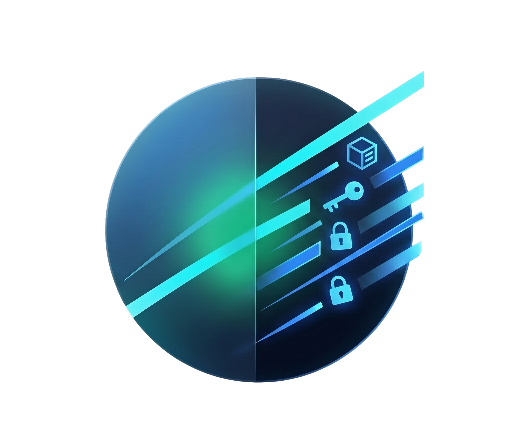

<div align="center">
  

  # 🔐 CipherDrive

  ### *Don't trust us. Don't trust Google. Trust Math.*

  A zero-knowledge, client-side encryption vault that turns your Google Drive into an impenetrable fortress, without ever touching a server.

  <br/>

  [](https://react.dev)
  [](https://www.typescriptlang.org)
  [](https://vite.dev)
  [](https://tailwindcss.com)
  [](https://pages.cloudflare.com)
  [](./LICENSE)

  <br/>

  [Live Demo](#) · [Report Bug](https://github.com/OmarAlali5/CipherDrive/issues) · [Request Feature](https://github.com/OmarAlali5/CipherDrive/issues)

</div>

<br/>

---

<br/>

## 🌐 Overview

Every file you upload to Google Drive is readable by Google. Every photo, every document, every secret, sitting in plain text on someone else's computer.

**CipherDrive changes that.**

CipherDrive is a **true Zero-Knowledge** web application. Your files are encrypted entirely inside your browser using the native **Web Crypto API** before a single byte ever leaves your device. The encryption key is derived from a password that **only you know**, it's never transmitted, never stored, and never logged. Once encryption is complete, the key is discarded from RAM.

The result? Even if Google, a hacker, or a government agency gains full access to your Drive, they will find nothing but indecipherable noise.

> **Zero-Knowledge means exactly that**: We can't read your files. Google can't read your files. *Nobody* can. EXCEPT YOU.

<br/>

## ✨ Core Features

| Feature | Description |
|---|---|
| 🛡️ **Zero-Knowledge Privacy** | Encryption keys are derived locally in the browser and **never leave your device**. Not even CipherDrive's own infrastructure (a static site!) can access them. |
| 🔑 **Military-Grade Cryptography** | Files are encrypted with **AES-256-GCM** — the same standard used by intelligence agencies and banks worldwide. Keys are derived using **PBKDF2** with **600,000 iterations** (exceeding OWASP recommendations). |
| ☁️ **Direct-to-Drive Architecture** | There is **no middleman server**. Files stream directly from your browser to the Google Drive API using resumable uploads. Your storage limit is your Google Drive quota — nothing more, nothing less. |
| 🎨 **Premium Cyber-Aesthetic UI** | A stunning interface featuring **glassmorphism**, **magnetic UI interactions**, **magic gradient borders**, and smooth **Framer Motion** animations — because security doesn't have to be ugly. |
| 🔄 **Resumable Uploads** | Large files are uploaded via the Google Drive **Resumable Upload** protocol, ensuring reliability even on unstable connections. |
| 📦 **Versioned Binary Format** | Encrypted files are packaged with a self-describing binary header (`CDRV2`), enabling seamless forward-compatible decryption as the protocol evolves. |

<br/>

## 🏗️ Tech Stack

<div align="center">

| Layer | Technology |
|:---:|:---:|
| **Framework** | React 19 · TypeScript 6 · Vite 8 |
| **Styling & UI** | Tailwind CSS 4 · shadcn/ui · Framer Motion |
| **State Management** | Zustand |
| **Cryptography** | Web Crypto API (AES-256-GCM · PBKDF2) |
| **Authentication** | Google Identity Services (OAuth 2.0) |
| **Cloud Storage** | Google Drive REST API v3 (Resumable Uploads) |
| **Deployment** | Cloudflare Pages |

</div>

<br/>

## 🔬 Under the Hood — Cryptographic Pipeline

CipherDrive's encryption pipeline is designed for both security and simplicity. Here's exactly what happens when you encrypt a file:

```
┌──────────────────────────────────────────────────────────────────────┐
│                     ENCRYPTION PIPELINE                              │
├──────────────────────────────────────────────────────────────────────┤
│                                                                      │
│  ① KEY DERIVATION                                                    │
│  ┌───────────┐    ┌──────────────┐    ┌────────────────────────┐     │
│  │ Password  │ +  │ Random Salt  │ →  │ PBKDF2 (600K rounds)   │     │
│  │ (user)    │    │ (16 bytes)   │    │ SHA-256                │     │
│  └───────────┘    └──────────────┘    └──────────┬─────────────┘     │
│                                                  ↓                   │
│                                       ┌─────────────────────┐       │
│                                       │ 256-bit AES Key     │       │
│                                       └──────────┬──────────┘       │
│                                                  ↓                   │
│  ② ENCRYPTION                                                        │
│  ┌───────────┐    ┌─────────────┐    ┌────────────────────────┐     │
│  │ Plaintext │ +  │ Random IV   │ →  │ AES-256-GCM            │     │
│  │ File      │    │ (12 bytes)  │    │ Authenticated Encrypt  │     │
│  └───────────┘    └─────────────┘    └──────────┬─────────────┘     │
│                                                  ↓                   │
│                                       ┌─────────────────────┐       │
│                                       │ Ciphertext + Auth   │       │
│                                       │ Tag (16 bytes)      │       │
│                                       └──────────┬──────────┘       │
│                                                  ↓                   │
│  ③ PACKAGING                                                         │
│  ┌──────────────────────────────────────────────────────────┐       │
│  │ CDRV2 (5B) │ Salt (16B) │ IV (12B) │ Ciphertext + Tag   │       │
│  └──────────────────────────────────────────────────────────┘       │
│                          ↓                                           │
│                   Upload to Google Drive                              │
│                   (Key evaporates from RAM)                          │
│                                                                      │
└──────────────────────────────────────────────────────────────────────┘
```

### Key Security Properties

- **🎲 Random Salt** — A unique 16-byte salt is generated for every file, ensuring the same password always produces a different key.
- **🎲 Random IV** — A unique 12-byte initialization vector ensures identical plaintexts produce different ciphertexts.
- **🔒 Authenticated Encryption** — AES-GCM provides both confidentiality *and* integrity. Any tampering with the ciphertext is detected and rejected.
- **🧠 Key Derivation Hardening** — 600,000 PBKDF2 iterations make brute-force attacks computationally infeasible (exceeds OWASP 2023 minimum of 600,000).
- **🗑️ Key Evaporation** — After encryption, the derived key is dereferenced and garbage-collected. It exists only for the duration of the operation.

<br/>

## 🚀 Getting Started

### Prerequisites

- **Node.js** ≥ 18
- **npm** ≥ 9
- A **Google Cloud Console** project with:
  - ✅ **Google Drive API** enabled
  - ✅ **OAuth 2.0 Client ID** (Web application type) configured
  - ✅ Authorized JavaScript origins set to `http://localhost:5173`

### Installation

```bash
# 1. Clone the repository
git clone https://github.com/OmarAlali5/CipherDrive.git
cd CipherDrive

# 2. Install dependencies
npm install

# 3. Create your environment file
cp .env.example .env
```

### Configuration

Create a `.env` file in the project root with your Google OAuth Client ID:

```env
VITE_GOOGLE_CLIENT_ID=your_google_client_id_here
```

> 💡 **Need a Client ID?** Head to the [Google Cloud Console](https://console.cloud.google.com/apis/credentials), create a new OAuth 2.0 Client ID for a "Web application", and add `http://localhost:5173` as an authorized JavaScript origin.

### Run Locally

```bash
npm run dev
```

The app will be available at **`http://localhost:5173`**.

### Build & Deploy

```bash
# Build for production
npm run build

# Preview with Wrangler (Cloudflare Workers)
npm run preview

# Deploy to Cloudflare Pages
npm run deploy
```

<br/>

## 🏛️ Project Architecture

```
CipherDrive/
├── public/                      # Static assets (logo, favicon, animations)
├── src/
│   ├── components/              # Reusable UI components (shadcn/ui based)
│   ├── core/
│   │   ├── crypto.ts            # Cryptographic facade (encrypt, decrypt, package)
│   │   └── driveApi.ts          # Google Drive API integration (resumable uploads)
│   ├── lib/
│   │   └── crypto/              # Crypto Abstraction Layer
│   │       ├── kdf/             # Key Derivation Functions (PBKDF2)
│   │       ├── engine.ts        # AES-GCM encryption engine
│   │       └── format.ts        # Versioned binary format (CDRV1/CDRV2)
│   ├── pages/
│   │   └── LandingPage.tsx      # Main application page
│   ├── store/
│   │   ├── authStore.ts         # Authentication state (Zustand)
│   │   └── fileStore.ts         # File management state (Zustand)
│   ├── types/                   # TypeScript type definitions
│   ├── App.tsx                  # Root component
│   └── main.tsx                 # Application entry point
├── vite.config.ts               # Vite + Cloudflare configuration
├── wrangler.jsonc               # Cloudflare Pages deployment config
└── package.json
```

<br/>

## ⚠️ Security Disclaimer

> [!CAUTION]
> **This is a true Zero-Knowledge application.**
>
> If you lose your encryption password, **your files are permanently and irreversibly unrecoverable**. There is no "Forgot Password" button. There is no recovery mechanism. There is no backdoor. **This is by design.**
>
> CipherDrive cannot reset your password because CipherDrive never knows your password. Write it down. Use a password manager. Treat it like the only key to a vault — because it is.

<br/>

## 🗺️ Roadmap

- [ ] 📁 Folder-level encryption & batch operations
- [ ] 🔑 Passkey / WebAuthn support
- [ ] 📱 Progressive Web App (PWA) with offline vault access
- [ ] 🤝 Secure file sharing via asymmetric key exchange
- [ ] 🧪 Argon2id KDF support (via WASM)

<br/>

## 🤝 Contributing

Contributions are welcome! If you find a security vulnerability, please **do not** open a public issue — email the author directly.

1. Fork the repository
2. Create your feature branch (`git checkout -b feature/amazing-feature`)
3. Commit your changes (`git commit -m 'Add amazing feature'`)
4. Push to the branch (`git push origin feature/amazing-feature`)
5. Open a Pull Request

<br/>

## 📄 License

Distributed under the **MIT License**. See [`LICENSE`](./LICENSE) for more information.

<br/>

## 👤 Author

**Omar Alali** — [@OmarAlali5](https://github.com/OmarAlali5)

<br/>

---

<div align="center">

  *Built with 🔒 and ☕ — because privacy is a right, not a feature.*

  <br/>

  ⭐ **Star this repo if you believe in privacy-first software.** ⭐

</div>
